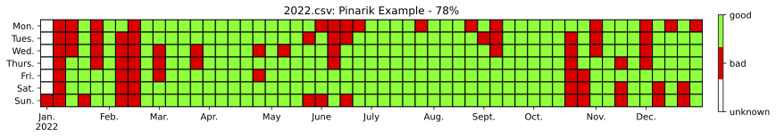

# Year Results Dashboard (YRD)

I log every day in my Notion page.

Every year in January I create visual dashboard based on my CVS export from Notion using this script.

It draws heatmap inside Jupiter Notebook and/or save it as PDF.

